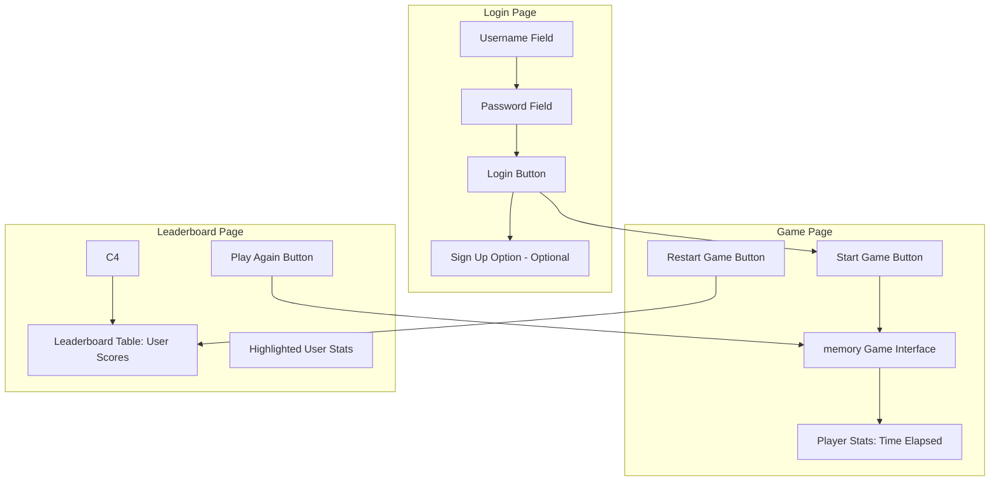

# Jamil Khalaf

[My Notes](notes.md)

This application is a modern web-based platform designed to combine nostalgia with technology. It features a user-friendly login system, an engaging memory game, and a competitive leaderboard that updates in real time. The platform ensures a seamless experience for players while showcasing key web development concepts, including responsive design, authentication, database integration, and real-time communication. By blending classic gameplay with contemporary web technologies, the application aims to provide entertainment while demonstrating technical excellence in web development.

> [!NOTE]
>  This is a template for your startup application. You must modify this `README.md` file for each phase of your development. You only need to fill in the section for each deliverable when that deliverable is submitted in Canvas. Without completing the section for a deliverable, the TA will not know what to look for when grading your submission. Feel free to add additional information to each deliverable description, but make sure you at least have the list of rubric items and a description of what you did for each item.

> [!NOTE]
>  If you are not familiar with Markdown then you should review the [documentation](https://docs.github.com/en/get-started/writing-on-github/getting-started-with-writing-and-formatting-on-github/basic-writing-and-formatting-syntax) before continuing.

## 🚀 Specification Deliverable

> [!NOTE]
>  Fill in this sections as the submission artifact for this deliverable. You can refer to this [example](https://github.com/webprogramming260/startup-example/blob/main/README.md) for inspiration.

For this deliverable I did the following. I checked the box `[x]` and added a description for things I completed.

- [x] Proper use of Markdown
- [x] A concise and compelling elevator pitch
- [x] Description of key features
- [x] Description of how you will use each technology
- [x] One or more rough sketches of your application. Images must be embedded in this file using Markdown image references.

### Elevator pitch

Bring the nostalgia of Pacman into the modern era with our real-time gaming platform! Users can log in, play a fast-paced Pacman game, and compete for top spots on a dynamic leaderboard. Our platform is lightweight, interactive, and perfect for casual gamers who love a challenge.

### Design

The Login Page includes fields for entering a username and password. A "Login" button redirects authenticated users to the Game page. Additionally, there is an optional "Sign Up" button for new users to register an account.

The Game Page features the Memory game interface. Users can click a "Start Game" button to initialize the game. Player statistics, such as the current score and time elapsed, are displayed either on the side or at the top of the screen. A "Restart Game" button is provided to navigate to the Leaderboard page.

The Leaderboard Page displays a table of high scores for all users, with the logged-in user's rank and score highlighted in the list. This page also includes a "Play Again" button to allow users to return to the Game page. For added fun, an image fetched from the external Dog API is displayed whenever a game ends.

### Key features

- Login/Logout System: Allow users to register, log in securely, and view their profile.
- Memory Game: A fun and interactive browser-based game with animated gameplay.
- Leaderboard: A database-powered leaderboard that displays scores of all players and updates in real time.

### Technologies

I am going to use the required technologies in the following ways.

- **HTML** - I will use HTML to structure the website, including creating a login page for user authentication, a game page to display the memory interface, and a leaderboard page to show user rankings.
- **CSS** - CSS will be used to style the website, ensuring a clean and responsive look. I will apply a retro memory aesthetic using themed colors and designs, make the layout responsive for both desktop and mobile users, and incorporate animations for transitions, button interactions, and gameplay elements.
- **React** - React will serve as the framework for building a single-page application. I will use a component-based architecture to divide the application into reusable parts, such as the Login, Game, and Leaderboard components. React will also handle routing between pages and provide reactive updates to the leaderboard and game state.
- **Service** - The backend services will handle essential functions, including user authentication (login and logout), saving and retrieving scores for the leaderboard, and interacting with an external API, such as the Dog API, to fetch random images for fun after a game ends.
- **DB/Login** - A database will store user information and scores. I will securely store hashed passwords in the database, display the logged-in user’s name on the game and leaderboard pages, and organize the data into tables for users (e.g., username and password hash) and scores (e.g., user ID, score, and timestamp).
- **WebSocket** - I will use WebSockets to enable real-time communication. This will include broadcasting leaderboard updates whenever a new score is submitted. Optionally, I will also broadcast live player activity, such as notifying others when a user starts playing the memory game.

## 🚀 AWS deliverable

For this deliverable I did the following. I checked the box `[x]` and added a description for things I completed.

- [x] **Server deployed and accessible with custom domain name** - [My server link](https://jamil260.click/).

## 🚀 HTML deliverable

For this deliverable I did the following. I checked the box `[x]` and added a description for things I completed.

- [x] **HTML pages** - I did complete this part of the deliverable, I did all pages including login, home, play, about, and leaderboards.
- [x] **Proper HTML element usage** - I did complete this part of the deliverable.
- [x] **Links** - I did complete this part of the deliverable. I added a link to my github repo.
- [x] **Text** - I did complete this part of the deliverable.
- [x] **3rd party API placeholder** - I did complete this part of the deliverable. I will fetch an image when a player wins.
- [x] **Images** - I did complete this part of the deliverable. I included an image of my memory game.
- [x] **Login placeholder** - I did complete this part of the deliverable. I added login boxes to authenticate users.
- [x] **DB data placeholder** - I did complete this part of the deliverable. I added a table to list the leaderboards.
- [x] **WebSocket placeholder** - I did complete this part of the deliverable. I added a placeholder where a message will appear whenever a player goes online.

## 🚀 CSS deliverable

For this deliverable I did the following. I checked the box `[x]` and added a description for things I completed.

- [x] **Header, footer, and main content body** - I did complete this part of the deliverable.
- [x] **Navigation elements** - I did complete this part of the deliverable.
- [x] **Responsive to window resizing** - I did complete this part of the deliverable.
- [x] **Application elements** - I did complete this part of the deliverable.
- [x] **Application text content** - I did complete this part of the deliverable.
- [x] **Application images** - I did complete this part of the deliverable.

My notes are in my notes.md file

## 🚀 React part 1: Routing deliverable

For this deliverable I did the following. I checked the box `[x]` and added a description for things I completed.

- [x] **Bundled using Vite** - I did complete this part of the deliverable.
- [x] **Components** - I did complete this part of the deliverable.
- [x] **Router** - Routing between login and voting components.

My notes are in my notes.md file

## 🚀 React part 2: Reactivity

For this deliverable I did the following. I checked the box `[x]` and added a description for things I completed.

- [x] **All functionality implemented or mocked out** - I did complete this part of the deliverable. I mocked the login and create functionality storing usernames in local strorage. I also mocked the websocket functionality when it changes the moment a game starts. 
- [x] **Hooks** - I did complete this part of the deliverable. I implemented hooks while using useState and useEffect. I used them in fetching the joke I put in my login page as well as using that to make the user automatically logout if being unactive for a period of 30s. 

My notes are in my notes.md file

## 🚀 Service deliverable

For this deliverable I did the following. I checked the box `[x]` and added a description for things I completed.

- [x] **Node.js/Express HTTP service** - I did complete this part of the deliverable. created a backend service using Node.js and Express that handles requests for logging out, logging in, and creating users by implementing the /api/auth endpoint
- [x] **Static middleware for frontend** - I did complete this part of the deliverable. Express app serves static files, ensuring that my frontend (React app) is properly hosted and available when the server runs
- [x] **Calls to third party endpoints** - I did complete this part of the deliverable. In the Authenticated component, I made a fetch request to the https://icanhazdadjoke.com/ API to retrieve a random joke and display it to the user.
- [x] **Backend service endpoints** - I did complete this part of the deliverable. implemented an API endpoint on the backend that handles the user logout, login, and saving scores processes.
- [x] **Frontend calls service endpoints** - I did complete this part of the deliverable. I created a fetch request to my backend's /api/auth endpoint and other endpoints to connect my frontend with the backend. 

My notes are in my notes.md file

## 🚀 DB/Login deliverable

For this deliverable I did the following. I checked the box `[x]` and added a description for things I completed.

- [x] **User registration** - I did complete this part of the deliverable. I implemented a registration endpoint that hashes the password using bcrypt and stores user details in MongoDB.
- [x] **User login and logout** - I did complete this part of the deliverable.I created login and logout endpoints that authenticate users using bcrypt and manage session tokens stored in cookies.
- [x] **Stores data in MongoDB** - I did complete this part of the deliverable. I connected to MongoDB using mongodb package and implemented functions to insert, update, and retrieve user data.
- [x] **Stores credentials in MongoDB** - I did complete this part of the deliverable. I securely store user credentials in MongoDB by hashing passwords before saving them.
- [x] **Restricts functionality based on authentication** - I did complete this part of the deliverable. I implemented authentication middleware that verifies user tokens before allowing access to protected routes.

## 🚀 WebSocket deliverable

For this deliverable I did the following. I checked the box `[x]` and added a description for things I completed.

- [x] **Backend listens for WebSocket connection** - I did complete this part of the deliverable by setting up a WebSocket server using Node.js and the ws library, ensuring the backend listens for incoming WebSocket connections.
- [x] **Frontend makes WebSocket connection** - I did complete this part of the deliverable by using JavaScript's WebSocket API to establish a connection to the backend server from the frontend.
- [x] **Data sent over WebSocket connection** - I did complete this part of the deliverable by serializing data into JSON format and sending it over the established WebSocket connection from the backend to the frontend.
- [x] **WebSocket data displayed** - I did complete this part of the deliverable by listening for incoming WebSocket messages on the frontend and updating the DOM to display the received data dynamically.
- [x] **Application is fully functional** - I did complete this part of the deliverable by testing the entire system to ensure data is sent, received, and displayed correctly, with no issues in the WebSocket connection or functionality.
