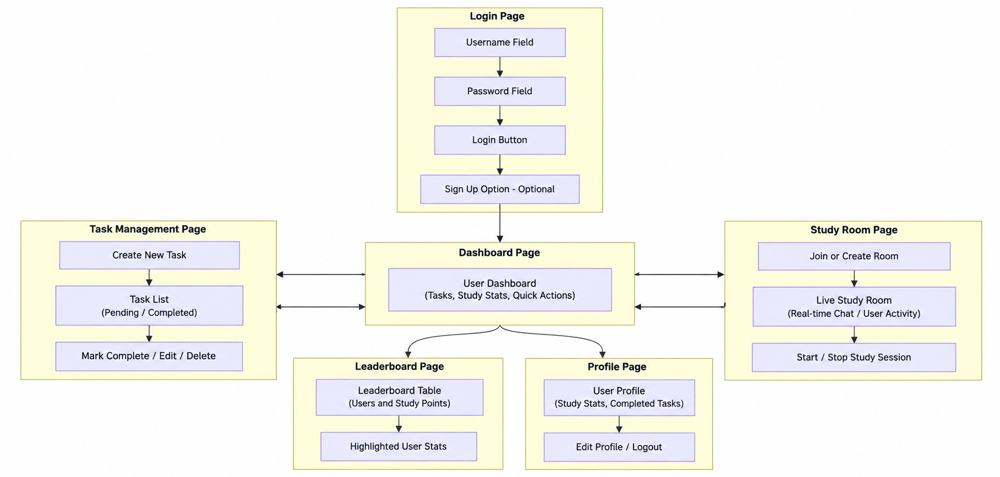

# Your startup name here

[My Notes](notes.md)

StudySync is a real-time study and productivity platform designed to help students stay focused, organize their work, and study together online. Users can create accounts, join study rooms, create tasks, track study sessions, and see the activity of other students in real time.

The application combines productivity tools with social features to make studying more interactive. Students can see who is currently studying, complete tasks, accumulate study points, and compete on a leaderboard.

> [!NOTE]
> This is a template for your startup application. You must modify this `README.md` file for each phase of your development. You only need to fill in the section for each deliverable when that deliverable is submitted in Canvas. Without completing the section for a deliverable, the TA will not know what to look for when grading your submission. Feel free to add additional information to each deliverable description, but make sure you at least have the list of rubric items and a description of what you did for each item.

> [!NOTE]
> If you are not familiar with Markdown then you should review the [documentation](https://docs.github.com/en/get-started/writing-on-github/getting-started-with-writing-and-formatting-on-github/basic-writing-and-formatting-syntax) before continuing.

### Elevator pitch

Studying online can feel isolated and unorganized. StudySync gives students one place to organize their work and study alongside friends in real time. Users can create study rooms, track tasks and study sessions, see when friends are active, and compete on a live productivity leaderboard. StudySync turns studying into a more social, organized, and motivating experience.

### Design

The Login Page allows users to enter a username and password to access the application, with an optional sign-up option for new users. After authentication, users are redirected to the Dashboard Page, which acts as the central hub of the application and displays tasks, study statistics, and quick actions.

The Task Management Page allows users to create new tasks, view pending and completed tasks, and mark tasks as complete, edit them, or delete them. Changes to tasks are stored in the database so users can access their information across different sessions.

The Study Room Page allows users to create or join study rooms with other students. Inside a study room, users can start or stop study sessions and see live activity from other participants. WebSockets are used to provide real-time communication, allowing events such as users joining a room, starting a study session, or completing tasks to appear immediately.

The Leaderboard Page displays users and their study points, allowing students to compare their productivity with others. The leaderboard can update in real time as users earn points. The Profile Page displays personal study statistics and completed tasks and provides options for managing the user's profile or logging out.

### Key features

- User Accounts: Users can register, log in, log out, and maintain their own study profile.

- Study Dashboard: Each user has a dashboard showing upcoming tasks, completed tasks, study time, and productivity points.

- Study Rooms: Users can create or join study rooms where multiple students can study together.

- Task Management: Students can create assignments or study tasks, set deadlines, and mark them as completed.

- Live Activity: Users can see real-time events such as when another student joins a room, starts studying, or completes a task.

- Leaderboard: Students earn points by completing tasks and study sessions. Rankings automatically update when scores change.

- External API: The application will retrieve motivational quotes or other useful study-related content from a third-party API.

### Technologies

I am going to use the required technologies in the following ways.

- HTML - I will use HTML to structure the website, including the login and sign-up pages, dashboard, task management page, study rooms, leaderboard, and user profile.

- CSS - CSS will be used to create a clean and responsive design that works on both desktop and mobile devices. I will style the dashboard, task cards, study rooms, forms, navigation elements, and leaderboard.

- React - React will be used to build the application as a single-page application. I will create reusable components for the Login, Dashboard, Tasks, Study Rooms, Leaderboard, and Profile pages. React will also handle routing, user interactions, and dynamic updates to the interface.

- Service - The backend will use Node.js and Express to provide API endpoints for user authentication, creating and managing tasks, recording study sessions, managing study rooms, and retrieving leaderboard information. I will also connect to a third-party API to display motivational quotes or other study-related content.

- DB/Login - MongoDB will store user accounts, tasks, study sessions, rooms, and productivity points. Passwords will be securely hashed before being stored, and authentication will be used to restrict certain features to logged-in users.

- WebSocket - I will use WebSockets for real-time communication between users. WebSockets will broadcast activity such as when a student joins a study room, starts or stops studying, or completes a task. They will also allow the leaderboard and study-room activity to update instantly without requiring users to refresh the page.

## 🚀 Specification Deliverable

> [!NOTE]
> Fill in this sections as the submission artifact for this deliverable. You can refer to this [example](https://github.com/webprogramming260/startup-example/blob/main/README.md) for inspiration.

For this deliverable I did the following. I checked the box `[x]` and added a description for things I completed.

- [x] I completed the prerequisites for this deliverable (Git commit requirement)
- [x] Proper use of Markdown
- [x] A concise and compelling elevator pitch
- [x] Description of key features
- [x] Description of how you will use each technology including your 3rd party API and use of WebSocket
- [x] One or more rough sketches of your application. Images must be embedded in this file using Markdown image references.

## 🚀 AWS deliverable

For this deliverable I did the following. I checked the box `[x]` and added a description for things I completed.

- [x] **Rented EC2 server** - I did complete this part of the deliverable.
- [x] **Leased domain name** - I did complete this part of the deliverable.
- [x] **Server accessible** from my domain: [https://byusync.click](https://byusync.click) - I did complete complete this part of the deliverable.

## 🚀 HTML deliverable

For this deliverable I did the following. I checked the box `[x]` and added a description for things I completed.

- [ ] I completed the prerequisites for this deliverable (Simon deployed, GitHub link, Git commits)
- [ ] **HTML pages** - I did not complete this part of the deliverable.
- [ ] **Proper HTML element usage** - I did not complete this part of the deliverable.
- [ ] **Links** - I did not complete this part of the deliverable.
- [ ] **Text** - I did not complete this part of the deliverable.
- [ ] **3rd party API placeholder** - I did not complete this part of the deliverable.
- [ ] **Images** - I did not complete this part of the deliverable.
- [ ] **Login placeholder** - I did not complete this part of the deliverable.
- [ ] **DB data placeholder** - I did not complete this part of the deliverable.
- [ ] **WebSocket placeholder** - I did not complete this part of the deliverable.

## 🚀 CSS deliverable

For this deliverable I did the following. I checked the box `[x]` and added a description for things I completed.

- [ ] I completed the prerequisites for this deliverable (Simon deployed, GitHub link, Git commits)
- [ ] **Visually appealing colors and layout. No overflowing elements.** - I did not complete this part of the deliverable.
- [ ] **Use of a CSS framework** - I did not complete this part of the deliverable.
- [ ] **All visual elements styled using CSS** - I did not complete this part of the deliverable.
- [ ] **Responsive to window resizing using flexbox and/or grid display** - I did not complete this part of the deliverable.
- [ ] **Use of a imported font** - I did not complete this part of the deliverable.
- [ ] **Use of different types of selectors including element, class, ID, and pseudo selectors** - I did not complete this part of the deliverable.

## 🚀 React part 1: Routing deliverable

For this deliverable I did the following. I checked the box `[x]` and added a description for things I completed.

- [ ] I completed the prerequisites for this deliverable (Simon deployed, GitHub link, Git commits)
- [ ] **Bundled using Vite** - I did not complete this part of the deliverable.
- [ ] **Components** - I did not complete this part of the deliverable.
- [ ] **Router** - I did not complete this part of the deliverable.

## 🚀 React part 2: Reactivity deliverable

For this deliverable I did the following. I checked the box `[x]` and added a description for things I completed.

- [ ] I completed the prerequisites for this deliverable (Simon deployed, GitHub link, Git commits)
- [ ] **All functionality implemented or mocked out** - I did not complete this part of the deliverable.
- [ ] **Hooks** - I did not complete this part of the deliverable.

## 🚀 Service deliverable

For this deliverable I did the following. I checked the box `[x]` and added a description for things I completed.

- [ ] I completed the prerequisites for this deliverable (Simon deployed, GitHub link, Git commits)
- [ ] **Node.js/Express HTTP service** - I did not complete this part of the deliverable.
- [ ] **Static middleware for frontend** - I did not complete this part of the deliverable.
- [ ] **Calls to third party endpoints** - I did not complete this part of the deliverable.
- [ ] **Backend service endpoints** - I did not complete this part of the deliverable.
- [ ] **Frontend calls service endpoints** - I did not complete this part of the deliverable.
- [ ] **Supports registration, login, logout, and restricted endpoint** - I did not complete this part of the deliverable.
- [ ] **Uses BCrypt to hash passwords** - I did not complete this part of the deliverable.

## 🚀 DB deliverable

For this deliverable I did the following. I checked the box `[x]` and added a description for things I completed.

- [ ] I completed the prerequisites for this deliverable (Simon deployed, GitHub link, Git commits)
- [ ] **Stores data in MongoDB** - I did not complete this part of the deliverable.
- [ ] **Stores credentials in MongoDB** - I did not complete this part of the deliverable.

## 🚀 WebSocket deliverable

For this deliverable I did the following. I checked the box `[x]` and added a description for things I completed.

- [ ] I completed the prerequisites for this deliverable (Simon deployed, GitHub link, Git commits)
- [ ] **Backend listens for WebSocket connection** - I did not complete this part of the deliverable.
- [ ] **Frontend makes WebSocket connection** - I did not complete this part of the deliverable.
- [ ] **Data sent over WebSocket connection** - I did not complete this part of the deliverable.
- [ ] **WebSocket data displayed** - I did not complete this part of the deliverable.
- [ ] **Application is fully functional** - I did not complete this part of the deliverable.
